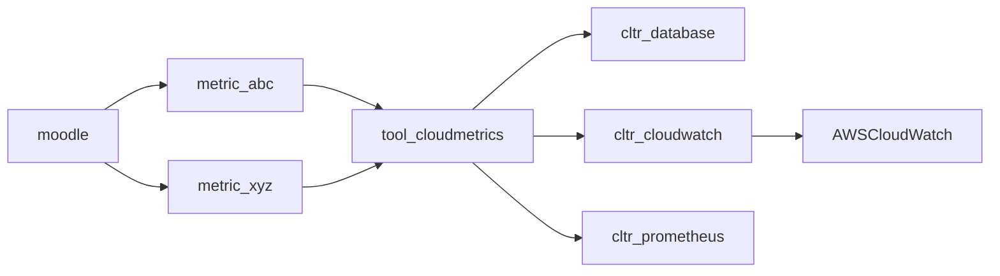

# moodle-tool_cloudmetrics


* [What is this?](#what-is-this)
* [Branches](#branches)
* [Architecture](#architecture)
  * [Metrics](#metrics)
  * [Collectors](#collectors)
* [Installation](#installation)
* [Configuration](#configuration)
  * [Moodle Database](#moodle-database)
  * [AWS CloudWatch](#aws-cloudwatch)
* [Alternatives](#alternatives)
  * [report_stats](#report_stats)
* [Support](#support)
* [Credits](#credits)

## What is this?

This plugin is intended to be a generic admin tool for defining various realtime metrics of various sorts.

Metrics may be 'built in' ones such as the same metrics which are beaconed back to Moodle HQ when you register you site, or they may be custom ones specific to your site.

In general a metric is any real time value that you might push to another service which monitors and tracks that metric over time such as a data warehouse or a tool like AWS CloudWatch.

## Branches

| Moodle version    | Branch           | PHP  |
|-------------------|------------------|------|
| Moodle 3.5+       | MOODLE_35_STABLE | 7.1+ |
| Totara 10+        | MOODLE_35_STABLE | 7.1+ |

## Architecture

The key architecture here is decoupling the gathering of the metrics from where those metrics are sent. This makes it easy to send metrics to more than onen place, or to change cloud providers and keep consistent metrics, or if you have a fleet with various cloud providers.



### Metrics

The plan is to have different sources of metrics, and 3rd party plugins can define their own metrics.


### Collectors

Metrics may be sent to one or more different services which we call a Collector.

We currently ship with a collector for AWS Cloudwatch and an internal Moodle database
collector which has no dependancies and it used as a reference implementation and
to validate the metrics are working consistently with an external collectors.


## Installation

Install this plugin via the usual way:

https://docs.moodle.org/en/Installing_plugins

Or directly using git:

```sh
git clone git@github.com:catalyst/moodle-tool_cloudmetrics.git admin/tool/cloudmetrics
```

## Configuration

### Moodle Database

We include a basic internal Moodle database collector which can record metrics for a limited time
and do some very basic graphing. It is mostly intended to be a reference implementation of a collector
and to provide a sanity check when comparing data to a 3rd party collector.


### AWS CloudWatch

Sends metric data to AWS Cloudwatch

https://docs.aws.amazon.com/cloudwatch/

#### Requires
- local/aws AWS SDK plugin (https://github.com/catalyst/moodle-local_aws)
- AWS account
- IAM user

#### IAM Access

You need to have an IAM user connected to your AWS account.
This user will need permissions to submit cloudwatch data.

This is the minimum user policy for access.

```json
    {
        "Version": "2012-10-17",
        "Statement": [{
            "Effect": "Allow",
            "Action": [
                "cloudwatch:PutMetricData"
            ],
            "Resource": "*"
        }]
    }
```

Or the user can be assigned the `CloudWatchFullAccess`
predefined policy.

Ideally, the execution environment will be configured with
the IAM credentials. However, the AWS access key and secret can be set
via the plugin settings page.

It can also be set in the config file as depicted here.
Substitute the value strings with your access keys.

```php
$CFG->forced_plugin_settings['cltr_cloudwatch']['aws_key'] = '<Access key ID>';
$CFG->forced_plugin_settings['cltr_cloudwatch']['aws_secret'] = '<Secret access key>';
```

Also see Cloudwatch IAM policy docs:

https://docs.aws.amazon.com/AmazonCloudWatch/latest/monitoring/iam-identity-based-access-control-cw.html

#### Settings

- awsregion - The region your AWS account is based in.
- awsversion - The version of the API.
- aws_key - The access key ID for the IAM user.
- aws_secret - The secret access key for the IAM user.
- namespace - Unique namespace for your installation. e.g. The sites's domain name.
- environment - The deployment environment (prod, dev, uat or qat)


## Alternatives

There are many plugins out there that do statistics and graphing of various metrics in Moodle
but there are not many that are designed to push these metrics to a 3rd party. If you are
aware of any please open an issue with details.


### report_stats

There is an optional report in Moodle core which when enabled provides some predefined statistics:

/report/stats/index.php

https://docs.moodle.org/en/Statistics

## Support

If you have issues please log them in
[GitHub](https://github.com/catalyst/moodle-auth_saml2/issues).

Please note our time is limited, so if you need urgent support or want to
sponsor a new feature then please contact
[Catalyst IT Australia](https://www.catalyst-au.net/contact-us).

## Credits

This plugin was developed by [Catalyst IT Australia](https://www.catalyst-au.net/).


