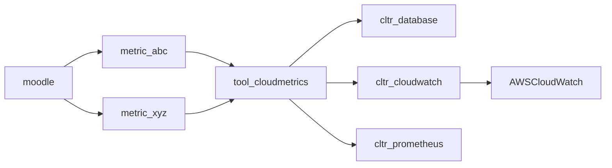

# moodle-tool_cloudmetrics

* [What is this?](#what-is-this)
* [Branches](#branches)
* [Architecture](#architecture)
  * [Metrics](#metrics)
  * [Collectors](#collectors)
* [Installation](#installation)
* [Configuration](#configuration)
* [Alternatives](#alternatives)
  * [report_stats](#report_stats)
* [Support](#support)
* [Credits](#credits)

## What is this?

This plugin is intended to be a generic admin tool for defining various realtime metrics of various sorts. 

Metrics may be 'built in' ones such as the same metrics which are beaconed back to Moodle HQ when you register you site, or they may be custom ones specific to your site.

In general a metric is any real time value that you might push to another service which monitors and tracks that metric over time such as a data warehouse or a tool like AWS CloudWatch. Eventually this plugin may support publishing to many potential services.

## Branches

## Architecture

The key architecture here is decoupling the gathering of the metrics from where those metrics are sent. This makes it easy to send metrics to more than onen place, or to change cloud providers and keep consistent metrics, or if you have a fleet with various cloud providers.

### Metrics

The plan is to have different sources of metrics, possible

### Collectors

Metrics may be sent to one or more different services which we call a Collector.

#### Build in admin report

TBA

We plan to have a very simple internal record of metrics with a limited data retention policy and basic graphing.

#### AWS CloudWatch

Sends metric data to [AWS Cloudwatch](https://docs.aws.amazon.com/cloudwatch/).

##### Requires
- [local/aws](https://github.com/catalyst/moodle-local_aws) plugin.
- AWS account
- IAM user.

##### IAM Access

You need to have an IAM user connected to your AWS account.
This user will need permissions to submit cloudwatch data.

This is the minimum user policy for access.

    {
        "Version": "2012-10-17",
        "Statement": [{
            "Effect": "Allow",
            "Action": [
                "cloudwatch:PutMetricData"
            ],
            "Resource": "*"
        }]
    }

Or the user can be assigned the `CloudWatchFullAccess`
predefined policy.

Ideally, the execution environent will be configured with
the IAM credentials. However, the following config can
also be used. Substitute the value strings with your access keys.

    $CFG->forced_plugin_settings['cltr_cloudwatch']['credentials'] = [
        'key' => '<Access key ID>',
        'secret' => '<Secret access key>',
    ];

Also see [Cloudwatch IAM policy docs](https://docs.aws.amazon.com/AmazonCloudWatch/latest/monitoring/iam-identity-based-access-control-cw.html).

##### Settings

- awsregion - The region your AWS account is based in.
- awsversion - The version of the API.
- namespace - Unique namespace for your installation. e.g. The sites's domain name.
- environment - The deployment environment (prod, dev, uat or qat)

#### Google Cloud Monitoring

TBA

https://cloud.google.com/monitoring

#### Azure Monitor

TBA

https://docs.microsoft.com/en-us/azure/azure-monitor/overview

#### Prometheus

TBA

https://prometheus.io/
https://prometheus.io/docs/introduction/overview/#what-are-metrics
https://github.com/promphp/prometheus_client_php

## Installation

## Configuration

## Alternatives

### report_stats

There is an optional report in Moodle core which when enabled provides some predefined statistics:

/report/stats/index.php

https://docs.moodle.org/en/Statistics

## Support

If you have issues please log them in
[GitHub](https://github.com/catalyst/moodle-auth_saml2/issues).

Please note our time is limited, so if you need urgent support or want to
sponsor a new feature then please contact
[Catalyst IT Australia](https://www.catalyst-au.net/contact-us).

## Credits

This plugin was developed by [Catalyst IT Australia](https://www.catalyst-au.net/).

